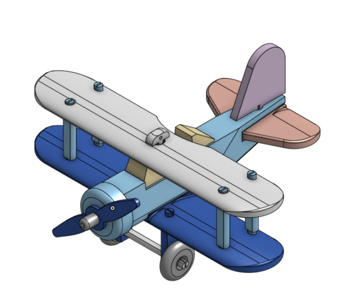

<!-- PROJECT Heirloom -->
<br />
<p align="center">
  <a href="https://github.com/Bromponie/Heirloom">
    
  </a>

  <h3 align="center">Heirloom</h3>

  <p align="center">
    "Project based on a book from Jim Makowicki on Making Heirloom Toys"
    <br />
    <a href="https://github.com/Bromponie/Heirloom"><strong>Explore the docs </strong></a>
    <br />
    <br />
    <a href="https://github.com/Bromponie/Heirloom/issues">Report STL issues</a>
    <a href="https://github.com/Bromponie/Heirloom/issues">Request Feature</a>
  </p>
</p>

<!-- TABLE OF CONTENTS -->
<details open="open">
  <summary><h2 style="display: inline-block">Table of Contents</h2></summary>
  <ol>
    <li>
      <a href="#about-the-project">About The Project</a>
      <ul>
        <li><a href="#built-with">Built With</a></li>
      </ul>
    </li>
    <li>
      <a href="#getting-started">Getting Started</a>
      <ul>
        <li><a href="#prerequisites">Prerequisites</a></li>
      </ul>
    </li>
    <li><a href="#projects">Project List</a></li>    
    <li><a href="#roadmap">Roadmap</a></li>
    <li><a href="#contributing">Contributing</a></li>
    <li><a href="#license">License</a></li>
    <li><a href="#contact">Contact</a></li>
    <li><a href="#acknowledgements">Acknowledgements</a></li>
  </ol>
</details>

<!-- ABOUT THE PROJECT -->
## About The Project
Project based on a book from Jim Makowicki on Making Heirloom Toys.  This project is supposed to be a woodworking project. Still, in the modern world and the newer generation, 3d printing is gaining traction and becoming more affordable so that almost every household can afford a 3d printer. 


### Built With
STL's are tested or being tested depending on the time of design process.  

* Designs are done using Onshape, STL's are exported from Onshape. www.onshape.com for free account.
* 3d Printer - Ender 3 v2. www.creality3dofficial.com/products/ender-3-v2-3d-printer 
* Cura slicers are used for the slicing, with a raft and support for simplicity. Slicer profile is also made available. [Slicer Profiles](Projects/Slicer%20Profiles)
* All Prints are done using PLA.

<!-- GETTING STARTED -->
## Getting Started

### Prerequisites
3D Printing - assuming you are familiar with 3d printing, bed levelling, etc. 


1. Clone the repo

   ```sh
   git clone https://github.com/Bromponie/Heirloom.git
   ```

## Projects
* [Dump Truck](Projects/Dump%20Truck)
* [Flat Bed Truck](Projects/Flat%Bed%20Truck)
* [Tow Truck](Projects/Tow%20Truck)
* [Vintage Truck](Projects/Vintage%20Truck)
* [Biplane](Projects/Biplane)

### Dump Truck

### Flat Bed Truck

### Tow Truck

### Vintage Truck

### Biplane


<!-- ROADMAP -->
## Roadmap


See the [open issues](https://github.com/Bromponie/Heirloom/issues) for a list of proposed features (and known issues).

 
<!-- LICENSE -->
## License

Distributed under the MIT License. See [LICENSE](##LICENSE) for more information.

<!-- CONTACT -->
## Contact

Brom - bromponie99@gmail.com

Project Link: [https://github.com/Bromponie/Heirloom](https://github.com/Bromponie/Heirloom)

<!-- ACKNOWLEDGEMENTS -->
## Acknowledgements

### Making Heirloom Toys by Jun Makowicki and Jim Makowicki
Format:	Paperback
Language: English
ISBN: 1561581127
ISBN13: 9781561581122
Release Date: October 1996
Publisher: Taunton Press, Incorporated
Length:	160 Pages
Weight:	0.68 lbs.
Link [https://www.amazon.com/Making-Heirloom-Toys-Jim-Makowicki/dp/1561581127](https://www.amazon.com/Making-Heirloom-Toys-Jim-Makowicki/dp/1561581127)


## Contributions <https://github.com/Bromponie/Heirloom/graphs/contributors>

 
## Issues <https://github.com/Bromponie/Heirloom/issues>

 
## LICENSE <https://github.com/Bromponie/Heirloom/blob/main/LICENSE>


